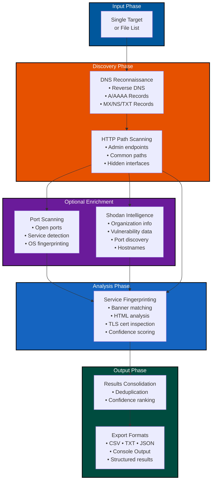

# VoidSeeker

**Discover the undiscoverable.** VoidSeeker is a focused deep-web reconnaissance tool that finds internet-exposed services not indexed by search engines - hidden admin panels, exposed management interfaces (IPMI, iDRAC, Cockpit), database consoles, and obscure endpoints that traditional search engines miss.

**Philosophy:** VoidSeeker is a *discovery and fingerprinting tool*, not another vulnerability scanner. It finds the targets; you choose what to do with them.

**Core Mission:**
1. **Discover** unindexed services via passive (CommonCrawl, DNS) and active (subdomain enumeration, port scanning) techniques
2. **Fingerprint** services with multi-signal correlation (banners, headers, TLS certs, HTML patterns)
3. **Report** findings with confidence scores and suggested next steps

## Disclaimer

VoidSeeker is intended for authorized security research and infrastructure discovery only. Users are responsible for complying with all applicable laws and obtaining proper authorization before scanning systems they don't own. The authors assume no liability for misuse.

## Architecture



**Current Implementation Status:**
- DNS Reconnaissance (reverse DNS, A/AAAA, MX/NS/TXT records)
- HTTP Path Scanning (44+ common paths, deduplication, redirect handling)
- Port Scanning (Nmap integration with multiple intensity levels)
- Service Fingerprinting (19+ services with confidence scoring)
- Shodan Enrichment (organization, country, ports, vulnerabilities)
- CSV/TXT Export (detailed results with metadata)
- Comprehensive Logging (DEBUG-level logging to log files)

**Key Design Principles:**
- **Single responsibility**: Discovery and fingerprinting only
- **No heavy vuln scanning**: Use Nmap NSE for basic checks; export targets for specialized tools
- **Non-destructive**: HTTP GET/HEAD only, no credential testing
- **Rate-limited**: Configurable delays, exponential backoff
- **Actionable output**: Confidence-ranked results for targeted follow-up

## Quick Start

```bash
# Ensure you have the most recent version of Python3
python3 --version

# Clone and setup
git clone https://github.com/echumley/voidseeker.git
cd VoidSeeker
python -m venv .venv
source .venv/bin/activate

# Install dependencies
pip install -r requirements.txt

# Run interactive menu
python main.py
```

### Shodan API Integration

VoidSeeker can optionally enrich scan results with real-world intelligence from the Shodan search engine:

**What Shodan enrichment adds:**
- Organization name and country information
- Open ports discovered by Shodan
- Hostnames and aliases
- Service tags and classifications

**Important: API Requirements**

A valid, non-free Shodan account is required to use the Shodan integration features. The free tier will work for a few small scans, but an Academic, Standard, or Freelancer membership is recommended for continued use.

> **Note:** VoidSeeker will automatically fall back to local fingerprinting if the Shodan API is unavailable, invalid, or rate-limited. The tool works perfectly fine without Shodan - enrichment is optional.

**Setting up Shodan API:**
1. Get your API key from [account.shodan.io](https://account.shodan.io/)
2. Configure VoidSeeker menu: Select "Configure Shodan Intelligence" and paste your key
3. Scan will automatically enrich results if the API key is valid

**Minimal Shodan usage:**
- Small scans (1-10 targets): Free tier + one manual lookup works
- Regular scanning (10-100 targets): Acadenuc or Basic Membership account recommended
- Enterprise/continuous scanning: Standard+ account required

Shodan enrichment is a convenience feature - all core discovery and fingerprinting works without it.

## Discovery Methods

### 1. Passive Discovery
- **DNS Enumeration**: MassDNS with wordlists for subdomain discovery
- **Certificate Transparency**: Parse CT logs for SANs and subdomains
- **DNS Records**: Query TXT, MX, CNAME for additional hosts

### 2. Active Discovery  
- **Port Scanning**: Nmap for service detection (common + admin ports)
- **HTTP Probing**: Check for web servers on discovered hosts
- **Banner Grabbing**: Collect service banners for fingerprinting

### 3. Service Fingerprinting
Multi-signal approach to identify admin interfaces with confidence scoring:

**Signals collected:**
- Port number (e.g., 443 for web consoles, 623 for IPMI)
- TLS certificate (CN, SAN, issuer)
- HTTP headers (Server, X-Powered-By, WWW-Authenticate)
- HTML content (title, meta tags, form fields, favicon hash)
- Service banners (SSH, FTP, IPMI, RDP)
- Response patterns (status codes, redirects)

**Confidence scoring:**
- **HIGH** (score ≥ 25): 3+ strong signals match known fingerprints
- **MEDIUM** (15-24): 2 signals match
- **LOW** (<15): 1 signal or weak matches

## Known Service Fingerprints

VoidSeeker looks for these exposed management interfaces:

| Service | Typical Ports | Key Signals |
|---------|--------------|-------------|
| Dell iDRAC | 443, 5900 | TLS CN "iDRAC", HTML title, specific cookies |
| HP iLO | 443, 17988 | TLS CN "iLO", redirect patterns |
| IPMI | 623 (UDP) | IPMI banner response |
| Cockpit | 9090 | HTML title "Cockpit", specific headers |
| Jenkins | 8080, 8443 | "X-Jenkins" header, specific HTML |
| Grafana | 3000 | Login page patterns, API endpoints |
| Portainer | 9000 | HTML title, favicon hash |
| ESXi | 443 | VMware-specific TLS cert, HTML patterns |
| Proxmox | 8006 | Specific login page, headers |
| Database consoles | Various | phpMyAdmin, Adminer, pgAdmin patterns |

*Fingerprint database is extensible via JSON configs*

## Ethical & Legal Considerations

**VoidSeeker is a reconnaissance tool - use responsibly.**

### Built-in Guardrails
- **Non-destructive by default**: Only banner grabbing, HTTP HEAD/GET requests
- **Rate limiting**: Configurable delays between requests
- **Logging**: Full audit trail of all probes
- **No credential testing**: No brute forcing or default password attempts
- **No exploitation**: Discovery only, never attempts to exploit

### Recommended Practices
1. **Obtain permission** before scanning infrastructure you don't own
2. **Check for VDP/Bug Bounty**: Verify the organization has a disclosure program
3. **Start passive**: Use CommonCrawl/DNS before active scanning
4. **Follow disclosure best practices**: Use CISA/OWASP/NCSC guidelines
5. **Rate limit aggressively**: Don't impact production systems
6. **Document everything**: Keep evidence for responsible disclosure

### Responsible Disclosure Resources
- [OWASP Vulnerability Disclosure Cheat Sheet](https://cheatsheetseries.owasp.org/cheatsheets/Vulnerability_Disclosure_Cheat_Sheet.html)
- [CISA VDP Template](https://www.cisa.gov/vulnerability-disclosure-policy-template)
- [NCSC Vulnerability Disclosure Toolkit](https://www.ncsc.gov.uk/information/vulnerability-reporting)

### Project Structure
```
voidseeker/
├── main.py                 # CLI entry point
├── requirements.txt
├── voidseeker/
│   ├── core/
│   │   ├── void_core.py    # Fingerprinting engine & Async scanning orchestration
│   │   └── menu.py      # Interactive CLI menu
│   └── modules/
│       ├── commoncrawl.py  # CommonCrawl API
│       ├── dns.py          # DNS enumeration
│       └── portscan.py     # Nmap wrapper
├── config/
│   ├── fingerprints.json        # Service fingerprints database
│   ├── loggin_config.json       # Adjustable logging configuration
│   └── wordlists/               # Enumeration wordlists
│       └── small-common-subdirectories.txt
│       └── common-subdirectories.txt
│       └── html-keywords.txt
└── logs/                        # Scan logs
```

## Development Roadmap

### Phase 1: MVP (Core Discovery)
- [x] CommonCrawl API integration
- [ ] Basic Nmap wrapper
- [ ] SQLite database setup
- [ ] Simple fingerprinting (HTTP headers, TLS)
- [ ] JSON output
- [ ] CLI: scan single domain

### Phase 2: Enhanced Fingerprinting
- [ ] Multi-signal correlation engine
- [ ] Confidence scoring system
- [ ] Fingerprint database (10+ services)
- [ ] HTML report generation
- [ ] Progress bars and status updates

### Phase 3: Scale & Polish
- [ ] MassDNS integration
- [ ] Async HTTP probing (aiohttp)
- [ ] PostgreSQL support
- [ ] Batch scanning from file
- [ ] Rate limiting and retry logic
- [ ] Configuration file support

### Phase 4: Advanced Features
- [ ] Certificate Transparency integration
- [ ] Custom fingerprint definitions (user-extensible)
- [ ] Screenshot capture (optional)
- [ ] Integration outputs (Nmap XML, Burp imports)
- [ ] Web UI (optional)

## Useful references & starting points (short list)

- Masscan (internet-scale discovery).  
- OWASP Vulnerability Disclosure Cheat Sheet (disclosure process).  
- CISA VDP template (official disclosure policy template).  
- NCSC Vulnerability Disclosure Toolkit (playbooks & templates).  
- Rapid7 IPMI/BMC guide (how attackers find/test BMCs).  

## References & Resources

### Discovery & Reconnaissance
- [Nmap](https://nmap.org/) - Network scanning and service detection
- [Certificate Transparency Logs](https://certificate.transparency.dev/) - SSL/TLS certificate monitoring
- [Shodan] (https://shodan.io) - Shodan threat intellgience

### Service Fingerprinting
- [Wappalyzer](https://www.wappalyzer.com/) - Web technology fingerprints
- [OWASP Web Application Fingerprinting](https://owasp.org/www-project-web-security-testing-guide/stable/4-Web_Application_Security_Testing/01-Information_Gathering/02-Fingerprint_Web_Server) - Techniques and best practices

### Management Interface Documentation
- [Rapid7 IPMI Research](https://www.rapid7.com/blog/post/2013/07/02/a-penetration-testers-guide-to-ipmi/) - IPMI vulnerabilities and detection

### Responsible Disclosure
- [OWASP Vulnerability Disclosure Cheat Sheet](https://cheatsheetseries.owasp.org/cheatsheets/Vulnerability_Disclosure_Cheat_Sheet.html)
- [CISA VDP Template](https://www.cisa.gov/vulnerability-disclosure-policy-template)
- [NCSC Vulnerability Disclosure Toolkit](https://www.ncsc.gov.uk/information/vulnerability-reporting)
- [Bugcrowd VDP List](https://github.com/bugcrowd/disclosure-policy) - Organizations with disclosure programs

## License

MIT License - Use responsibly and ethically.